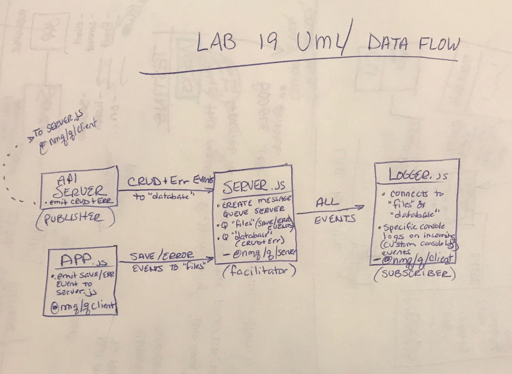

# Lab-19-Server
## Message Queue Server


### Author: Chloie Parsons 

## Links and Resources
* [Submission PR](https://github.com/chloieparsons-401-advanced-javascript/lab-19-server/pull/1)
* [Travis](https://www.travis-ci.com/chloieparsons-401-advanced-javascript/lab-19-server)


## Modules
* ```server.js``` 
    - A message queue server that has a queue called 'file' that monitors save and error events and a queue called 'database' that monitors CRUD+E (create, read, update, delete, error) events.

## Running the app
* ```npm i``` (to install dependencies)

* ```npm run start``` (fires up node server.js)

## Tests
* ```npm run test```
* ```npm run test-watch```
* ```npm run lint```

## UML
